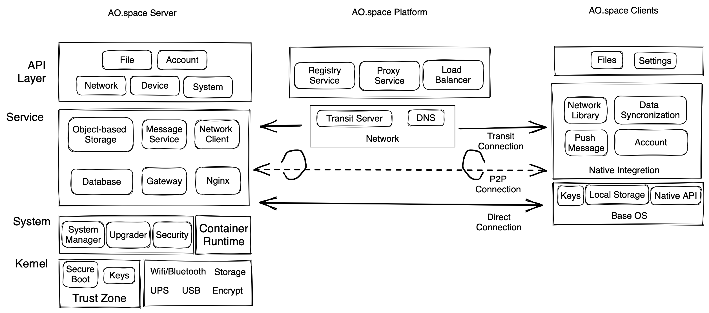

# ao.space

English | [简体中文](./README_cn.md)

AO.space is a solution that focuses on protecting personal data security and privacy. Utilizing end-to-end encryption and device-based authentication, users have complete control over their personal accounts and data. AO.space also employs various technologies, including transparent platform forwarding, peer-to-peer acceleration, and LAN direct connection, to enable fast access to personal data from anywhere at any time. Leveraging Progressive Web App and cloud-native technology, AO.space has developed an integrated application ecosystem that could include both front-end and back-end components.

AO.space is composed of three parts: server-side, client-side, and platform-side. The server-side and client-side run on personal devices and establish encrypted communication channels with public key authentication. The server-side supports x86_64 and aarch64 architectures and can run on personal servers, computers, or other similar devices. The client-side supports Android, iOS, and Web platforms, providing users with the convenience of using AO.space anywhere and anytime.

## Architecture

The AO.space system is composed of three main components: the server, the platform, and the client. The server is built into the device (also known as AO.space box). The platform offers fundamental network resources and relevant management. The client includes Web, iOS, Android platforms. Below is a general architectural design diagram for these components. We will go through each component and provide further details for them.

### Server-side

The core of the AO.space, also known as the AO.space Server, consists of sofeware, hardware, operating system (such as EulixOS/openEuler and other Linux distributions). On top of the basic operating system, various space-related services and essential components are deployed primarily using containerization. It comprises the following modules:

- Web Server(nginx): The entry service for traffic into the AO.space.
- Agent: It acts as a bridge between the client, platform, and server, adapting to the operating system.
- Gateway: Responsible for API routing, forwarding, end-to-end encryption and decryption, authentication, and authorization of overal the AO.space application-layer requests.
- AOFS: It offers storage and management functionalities for space files. It is a virtual file system that combines object storage and file storage methods.
- Preview: It's in charge of generating preview images for space files.
- ContainerMgr: It is used to communicate with underlying container services.
- Databases:
  - SQL Instance (Postgresql): It provides data storage and management for relational databases within the space.
  - NoSQL Instance (Redis): It offers data storage and management for non-relational databases within the space, as well as messaging capabilities.
- Network client: It's part of implementation for transiting network from internet to NAT office or home netrok. It also helps to establish P2P connections with the AO.space client.
- Applications: They are divided into three types: front-end only, back-end only, and hybrid applications which contain front-end and back-end. They are mainly used to expand the functionality of the AO.space services and are the key elements of the AO.space ecosystem. These official or third-party applications can be accessed through the AO.space Space user domain from internet, such as Card/CalDAV services.

### Client-side

The client functions as the system's frontend, granting us with access to all functionalities of the AO.space. It encompasses Web, iOS, Android platforms, providing the following key modules:

- End-to-End Encryption Channel
- Files
- Devices
- Family
- Space Application
- Developer Options
- Security

### Platform-side

The platform offers essential network resources and associated management capabilities. It comprises the subsequent components:

- Endpoint: It handles and dispatches the overall traffic within the AO.space ecosystem.
- BaseService: It offers the AO.space device registration service, along with coordinating and managing platform network resources (domains, forwarding proxies, etc.).
- Transit server: It gives us the ability to send network traffic from internet to the AO.space device typically connected within a NAT office or home network. Additionally, it also supplies STUN services to enable to transit traffic through p2p channel using the WebRTC-based protocol.

For more information, please visit the [#Documentation](#documentation).

## Source code repository introduction

The overall project includes ：

- [server](./server/)
- [client](./client/)
- [platform](./platform/)

### Server repository introduction

The server is the main data carrier of AO.space and is also the core of data protection. It consists of the following repositories:
  
- [space-agent](https://github.com/ao-space/space-agent)：It provides services such as device binding, system service module startup bootstrapping, and management.
- [space-aofs](https://github.com/ao-space/space-aofs)：It provides file access services, including interfaces for file querying, chunked uploading, downloading, and more.
- [space-gateway](https://github.com/ao-space/space-gateway)：The end-to-end request security processing module receives requests, decrypts them, and forwards them to the relevant modules. It encrypts the responses and sends them back to the requesting client.
- [space-filepreview](https://github.com/ao-space/space-filepreview)：It supports the generation of thumbnails and preview images for media files. This functionality allows users to generate smaller versions or preview images of their media files, which can be useful for displaying file previews or creating thumbnails for faster loading.
- [space-media-vod](https://github.com/ao-space/space-media-vod)：Provide streaming media data access services
- [space-web](https://github.com/ao-space/space-web)：Providing an Nginx reverse proxy service for serving web-based service resources and requests
- [space-upgrade](https://github.com/ao-space/space-upgrade)：On-demand startup, mainly responsible for server-side upgrades

### Clients repository introduction

The client supports Android, iOS, and Web versions, and consists of the following repositories:

- [client-android](https://github.com/ao-space/client-android)：Provide a client on Android platform for AO.space.
- [client-ios](https://github.com/ao-space/client-ios)：Provide a client on iOS platform for AO.space.
- [space-web](https://github.com/ao-space/space-web)：Deployed on the server, providing a web-based client for AO.space.

### Platform repository introduction

The responsibility of AO.space Platform is to establish a transparent communication channel for personal equipment. It consists of the following repositories:

- [platform-proxy](https://github.com/ao-space/platform-proxy)：provide high-availability forwarding and horizontal expansion support for the requests from clients.
- [platform-base](https://github.com/ao-space/platform-base)：provide the registration service of AO.space, and coordinate and manage the platform network resources.
- [gt](https://github.com/ao-space/gt)：provides network support services that penetrate NAT access AO.space through relay forwarding.

## Build and deploy

To deploy and run the project from a release version, or to build and run it from the source code, please refer to [build-and-deploy](./docs/en/build-and-deploy.md).

## Documentation

- [Developer Documentation](https://ao.space/en/docs)
- [User Manual](https://ao.space/en/support/help)
- [Blog](https://ao.space/en/blog)
- [API References](https://github.com/ao-space/api-doc)

## Contribution Guidelines

Contributions to this project are very welcome. Here are some guidelines and suggestions to help you get involved in the project.

[Contribution Guidelines](./docs/en/contribution-guidelines.md)

## Contact us

- Email: <developer@ao.space>
- [Official Website](https://ao.space)
- [Discussion group](https://slack.ao.space)

## License

AO.space is open-sourced under Apache License 2.0, see [LICENSE](./LICENSE). The following sub-projects use other open-source licenses：

- [space-media-vod](https://github.com/ao-space/space-media-vod) -  AGPL-3.0 license

## Acknowledgments

AO.space heavily relies on the open-source achievements of other projects. We would like to express our special thanks to them:
[Redis](https://redis.io/)、[OpenResty](https://github.com/openresty/)、[nginx](http://nginx.org)、[Gitlab](https://about.gitlab.com/)、[postgres](https://github.com/postgres/postgres)、[Go](https://github.com/golang/go)、[Gin](https://github.com/gin-gonic/gin)、[kaltura/nginx-vod-module](https://github.com/kaltura/nginx-vod-module)、[gson](https://github.com/google/gson)、[glide](https://github.com/bumptech/glide)、[lottie](https://github.com/airbnb/lottie-android)、[fastjson](https://github.com/alibaba/fastjson)、[eventbus](https://github.com/greenrobot/EventBus)、[ExoPlayer](https://github.com/google/ExoPlayer)、[AndroidPdfViewer](https://github.com/barteksc/AndroidPdfViewer)、[SmartRefreshLayout](https://github.com/scwang90/SmartRefreshLayout)、[Android-Office](https://github.com/zjtone/Android-Office)、[okhttp](https://github.com/square/okhttp)、[Rxjava](https://github.com/ReactiveX/RxJava)、[RxAndroid](https://github.com/ReactiveX/RxAndroid)、
[Retrofit](https://github.com/square/retrofit)、[WebSocket](https://github.com/TooTallNate/Java-WebSocket)、[ZXing](https://github.com/zxing/zxing)、[BouncyCastle](https://github.com/bcgit/bc-java)、[YCBase](https://github.com/ungacy/YCBase)、[YCEasyTool](https://github.com/ungacy/YCEasyTool)、[SAMKeychain](https://github.com/soffes/SAMKeychain)、[OpenSSL-Universal](https://github.com/cute/OpenSSL-Universal)、[CocoaLumberjack](https://github.com/CocoaLumberjack/CocoaLumberjack)、[SocketRocket](https://github.com/facebookincubator/SocketRocket)、[Reachability](https://github.com/tonymillion/Reachability)、[MJExtension](https://github.com/CoderMJLee/MJExtension)、[FileMD5Hash](https://github.com/JoeKun/FileMD5Hash)、[AFNetworking](https://github.com/AFNetworking/AFNetworking)、[JSONModel](https://github.com/jsonmodel/jsonmodel)、[ISO8601](https://github.com/erlsci/iso8601)、[LookinServer](https://github.com/QMUI/LookinServer)、[SDWebImage](https://github.com/SDWebImage/SDWebImage)、[YYModel](https://github.com/ibireme/YYModel)、[YYCache](https://github.com/ibireme/YYCache)、[FLAnimatedImage](https://github.com/Flipboard/FLAnimatedImage)、[Masonry](https://github.com/SnapKit/Masonry)、[WCDB](https://github.com/Tencent/wcdb)、[SVProgressHUD](https://github.com/SVProgressHUD/SVProgressHUD)、[SDCycleScrollView](https://github.com/gsdios/SDCycleScrollView)、[IQKeyboardManager](https://github.com/hackiftekhar/IQKeyboardManager)、[SSZipArchive](https://github.com/wuhaiwei/SSZipArchive)、[GKPhotoBrowser](https://github.com/QuintGao/GKPhotoBrowser)、[GCDWebServer](https://github.com/swisspol/GCDWebServer)、[lottie-ios](https://github.com/airbnb/lottie-ios)、[preview-generator](https://github.com/algoo/preview-generator)、[quarkus](https://github.com/quarkusio/quarkus)、[graalvm](https://github.com/graalvm)、[lombok](https://github.com/projectlombok/lombok)、[guava](https://github.com/google/guava)、[okhttp](https://github.com/square/okhttp)、[pinyin4j](https://github.com/belerweb/pinyin4j)、[rest-assured](https://github.com/rest-assured/rest-assured)、[ip2region](https://github.com/lionsoul2014/ip2region)、[findbugs](https://findbugs.sourceforge.net/)、[commons-codec](https://commons.apache.org/proper/commons-codec/)、[java-totp](https://github.com/samdjstevens/java-totp)、[jakarta.mail](https://github.com/jakartaee/mail-api) and so on。

Finally, thank you for your contribution to this project. We welcome contributions in all forms, including but not limited to code contributions, issue reports, feature requests, documentation writing, etc. We believe that with your help, this project will become more perfect and stronger.
