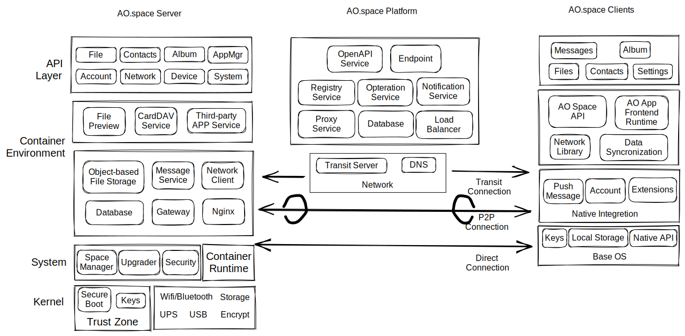
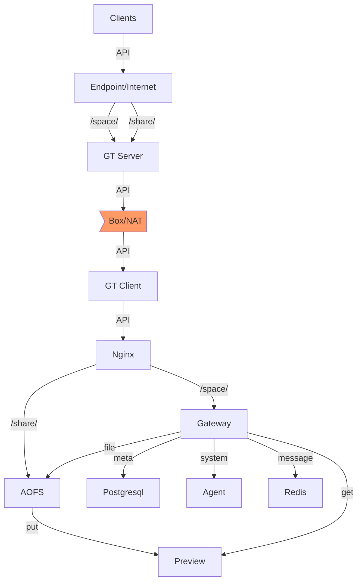

# ao.space

[English](README.md) | 简体中文

AO.space（傲空间）是一个以保护个人数据安全和隐私为核心的解决方案。通过端对端加密、基于设备认证等技术，确保用户完全掌控个人账号和数据。同时，采用平台透明转发、点对点加速、局域网直连等技术，让用户随时随地的极速访问个人数据。傲空间利用 PWA（Progressive Web App）和云原生技术，设计并打造前后端一体的应用生态。

AO.space（傲空间）由服务端、客户端、平台三个部分组成。服务端和客户端只运行在个人设备上，使用公钥认证建立加密通信通道。服务端是傲空间管理保护用户数据的核心部分，目前支持 x86_64 和 aarch64 两个架构，可运行在个人服务器、个人计算机等设备上。客户端让用户在不同平台上快速安全的访问个人数据，目前支持多个平台，包括 Android、iOS 和 Web ，方便用户随时随地使用。

## 系统整体架构

傲空间系统由三个主要部分构成：服务器、平台和客户端。服务器内置于设备中（也称为傲空间盒子）。平台提供基础网络资源和相关管理。客户端包括 Web、iOS 和 Android 平台。以下是这些组件的一般架构设计图。我们将对每个组件提供进一步的详细信息。

### 服务器

服务器是傲空间的核心，也称为傲空间盒子，由软件、基本操作系统（如 EulixOS/openEuler 和其他 Linux 发行版）和硬件组成。在基本操作系统之上，通过容器化部署了与空间相关的服务和基本组件。它包括以下模块：

- Nginx：用于将流量引入傲空间的入口服务。
- 代理（Agent）：作为客户端、平台和服务器之间的桥梁，适应操作系统。
- 网关（Gateway）：负责 API 的路由、转发、端到端加密和解密、认证以及整体傲空间应用层请求的授权。
- AOFS：提供空间文件的存储和管理功能。它是一个虚拟文件系统，结合了对象存储和文件存储方法。
- 预览（Preview）：负责为空间文件生成预览图。
- 容器管理器（ContainerMgr）：用于与底层容器服务进行通信。
- 数据库：
  - SQL 实例（Postgresql）：为空间内的关系型数据库提供数据存储和管理。
  - NoSQL 实例（Redis）：为空间内的非关系型数据库提供数据存储和管理，以及消息功能。
- GT 客户端（GT cli）：是从互联网将网络流量传输到通常连接在 NAT 办公室或家庭网络中的傲空间设备的实现的一部分。它还有助于与傲空间客户端建立点对点（P2P）连接。
- 傲空间应用：它被分为前端小程序、容器服务和前后端混合应用三种类型，其主要用于扩展傲空间服务功能，是傲空间应用生态的主要组成部分。这些官方或第三方应用程序可以通过傲空间用户域访问，例如 Card/CalDAV 服务。

### 平台

平台提供基本网络资源和相关管理能力。它包括以下组件：

- 入口网关（Endpoint）：负责处理和分配傲空间生态系统内的整体流量。
- 基础服务（BaseService）：提供傲空间设备注册服务，同时协调和管理平台网络资源（域名、转发代理等）。
- GT 服务（GT server）：使我们能够将网络流量从互联网发送到通常连接在 NAT 办公室或家庭网络中的傲空间设备。此外，它还提- 供 STUN 服务，以使客户端能够通过基于 WebRTC 相关协议直接进行 NAT 穿透访问。

### 客户端

客户端充当整个系统的前端，使我们能够访问傲空间的所有功能。它包括 Web、iOS 和 Android 平台，提供以下关键模块：

- 端到端加密通道
- 空间绑定
- 文件
- 相册
- 设备
- 我的分享
- 家庭
- 傲空间应用程序
- 开发者选项
- 安全

下面图示了一个 API 请求通过各个组件从互联网到傲空间服务的基本访问过程。

更多内容，请访问 [官网](https://ao.space/blog)。

## 源码仓库介绍

项目整体包含三大部分 ：

- 平台 [platform](./platform/)
- 服务端 [server](./server/)
- 客户端 [client](./client/) 。

### 平台(platform)仓库介绍

傲空间平台为个人设备提供透明通信通道服务和互联网访问的安全防护，由如下仓库组成：

- [platform-proxy](https://github.com/ao-space/platform-proxy)：为傲空间用户域名流量提供高可用转发和横向扩容的支持。
- [platform-base](https://github.com/ao-space/platform-base)：为傲空间设备提供注册服务，以及协调和管理平台网络资源。
- [gt](https://github.com/ao-space/gt)：提供通过中继转发的方式穿透 NAT 访问设备的网络支持服务。

### 服务端(server)仓库介绍

服务器为傲空间主要数据载体，也是数据保护的核心，由如下仓库组成：
  
- [space-agent](https://github.com/ao-space/space-agent)：提供设备绑定、系统服务模块启动引导和管理等服务
- [space-aofs](https://github.com/ao-space/space-aofs)：提供文件访问服务，包括文件查询、分片上传、下载等接口
- [space-gateway](https://github.com/ao-space/space-gateway)：端到端的请求安全处理模块，收到请求后解密后转发给相关模块，对回应加密后响应给请求端。
- [space-filepreview](https://github.com/ao-space/space-filepreview)：支持媒体文件的缩略图、预览图的生成
- [space-media-vod](https://github.com/ao-space/space-media-vod)：提供流媒体播放服务
- [space-web](https://github.com/ao-space/space-web)：提供 web 端的服务资源及请求的 nginx 反向代理服务
- [space-upgrade](https://github.com/ao-space/space-upgrade)：按需启动，主要负责server端的升级

### 客户端（client）仓库介绍

客户端支持Android、iOS、web版本，由如下仓库组成：

- [client-android](https://github.com/ao-space/client-android)：提供 Android 端的傲空间客户端
- [client-ios](https://github.com/ao-space/client-ios)：提供 iOS 端的傲空间客户端
- [space-web](https://github.com/ao-space/space-web)：部署在 server 上，提供 web 端的傲空间客户端

## 构建和部署

从发布版进行部署，或从源码构建并部署，请参考 [build-and-deploy](./docs/build-and-deploy_CN.md)

## 文档

[API 文档](https://github.com/ao-space/api-doc)

## 贡献指南

我们非常欢迎对本项目进行贡献。以下是一些指导原则和建议，希望能够帮助您参与到项目中来。

[贡献指南](./docs/contribution-guidelines_CN.md)

## 联系我们

- 邮箱：<developer@ao.space>
- [傲空间官网](https://ao.space)
- [讨论组](https://slack.ao.space)
- [Twitter](https://twitter.com/AOspaceOSC)

您也可以查看傲空间提供的[帮助中心](https://ao.space/support/help)

## License

AO.space 在 Apache License 2.0 下进行开源, 请查看 [LICENSE](./LICENSE)。以下子项目使用其它开源协议：

- [space-media-vod](https://github.com/ao-space/space-media-vod) -  AGPL-3.0 license

## 致谢

我们的项目，离不开其它项目的开源成果，在此特别感谢 [Redis](https://redis.io/)、[OpenResty](https://github.com/openresty/)、[nginx](http://nginx.org)、[Gitlab](https://about.gitlab.com/)、[postgres](https://github.com/postgres/postgres)、[Go](https://github.com/golang/go)、[Gin](https://github.com/gin-gonic/gin)、[kaltura/nginx-vod-module](https://github.com/kaltura/nginx-vod-module)、[gson](https://github.com/google/gson)、[glide](https://github.com/bumptech/glide)、[lottie](https://github.com/airbnb/lottie-android)、[fastjson](https://github.com/alibaba/fastjson)、[eventbus](https://github.com/greenrobot/EventBus)、[ExoPlayer](https://github.com/google/ExoPlayer)、[AndroidPdfViewer](https://github.com/barteksc/AndroidPdfViewer)、[SmartRefreshLayout](https://github.com/scwang90/SmartRefreshLayout)、[Android-Office](https://github.com/zjtone/Android-Office)、[okhttp](https://github.com/square/okhttp)、[Rxjava](https://github.com/ReactiveX/RxJava)、[RxAndroid](https://github.com/ReactiveX/RxAndroid)、
[Retrofit](https://github.com/square/retrofit)、[WebSocket](https://github.com/TooTallNate/Java-WebSocket)、[ZXing](https://github.com/zxing/zxing)、[BouncyCastle](https://github.com/bcgit/bc-java)、[YCBase](https://github.com/ungacy/YCBase)、[YCEasyTool](https://github.com/ungacy/YCEasyTool)、[SAMKeychain](https://github.com/soffes/SAMKeychain)、[OpenSSL-Universal](https://github.com/cute/OpenSSL-Universal)、[CocoaLumberjack](https://github.com/CocoaLumberjack/CocoaLumberjack)、[SocketRocket](https://github.com/facebookincubator/SocketRocket)、[Reachability](https://github.com/tonymillion/Reachability)、[MJExtension](https://github.com/CoderMJLee/MJExtension)、[FileMD5Hash](https://github.com/JoeKun/FileMD5Hash)、[AFNetworking](https://github.com/AFNetworking/AFNetworking)、[JSONModel](https://github.com/jsonmodel/jsonmodel)、[ISO8601](https://github.com/erlsci/iso8601)、[LookinServer](https://github.com/QMUI/LookinServer)、[SDWebImage](https://github.com/SDWebImage/SDWebImage)、[YYModel](https://github.com/ibireme/YYModel)、[YYCache](https://github.com/ibireme/YYCache)、[FLAnimatedImage](https://github.com/Flipboard/FLAnimatedImage)、[Masonry](https://github.com/SnapKit/Masonry)、[WCDB](https://github.com/Tencent/wcdb)、[SVProgressHUD](https://github.com/SVProgressHUD/SVProgressHUD)、[SDCycleScrollView](https://github.com/gsdios/SDCycleScrollView)、[IQKeyboardManager](https://github.com/hackiftekhar/IQKeyboardManager)、[SSZipArchive](https://github.com/wuhaiwei/SSZipArchive)、[GKPhotoBrowser](https://github.com/QuintGao/GKPhotoBrowser)、[GCDWebServer](https://github.com/swisspol/GCDWebServer)、[lottie-ios](https://github.com/airbnb/lottie-ios)、[preview-generator](https://github.com/algoo/preview-generator)、[quarkus](https://github.com/quarkusio/quarkus)、[graalvm](https://github.com/graalvm)、[lombok](https://github.com/projectlombok/lombok)、[guava](https://github.com/google/guava)、[okhttp](https://github.com/square/okhttp)、[pinyin4j](https://github.com/belerweb/pinyin4j)、[rest-assured](https://github.com/rest-assured/rest-assured)、[ip2region](https://github.com/lionsoul2014/ip2region)、[findbugs](https://findbugs.sourceforge.net/)、[commons-codec](https://commons.apache.org/proper/commons-codec/)、[java-totp](https://github.com/samdjstevens/java-totp)、[jakarta.mail](https://github.com/jakartaee/mail-api) 等。

最后，感谢您对本项目的贡献。我们欢迎各种形式的贡献，包括但不限于代码贡献、问题报告、功能请求、文档编写等。我们相信在您的帮助下，本项目会变得更加完善和强大。
